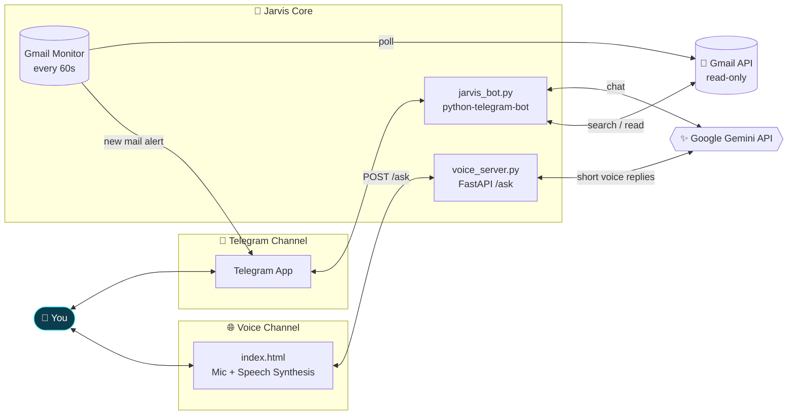
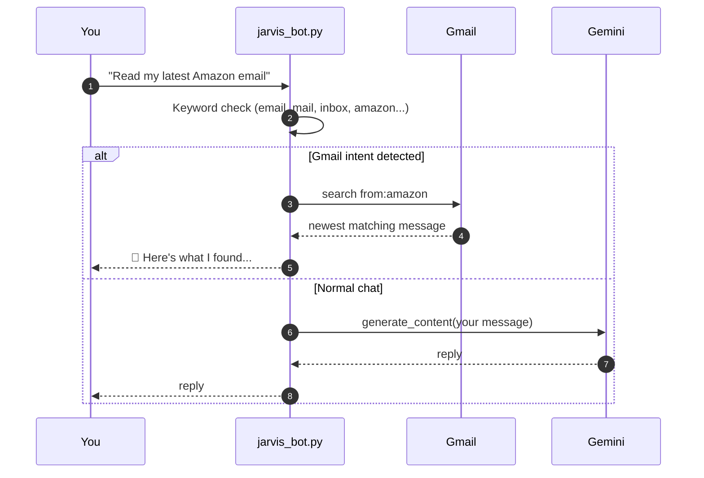

<div align="center">


<a href="https://github.com/AlwinJCOde667/jarvis">
  
</a>

<br/>


**A personal AI assistant inspired by J.A.R.V.I.S. from Iron Man.**
Chat with it on Telegram, talk to it in your browser, and let it watch your inbox while you build cool stuff.

[Features](#-features) • [Architecture](#-architecture) • [Quick Start](#-quick-start) • [Commands](#-commands) • [Voice Mode](#-voice-mode) • [Configuration](#-configuration) • [Roadmap](#-roadmap)

</div>

---

## 🎬 The Inspiration

> *"Sometimes you gotta run before you can walk."* — Tony Stark

In the Marvel films, Tony Stark's J.A.R.V.I.S. (**J**ust **A** **R**ather **V**ery **I**ntelligent **S**ystem) runs his home, reads his messages, answers by voice, and is always one sentence away. This project is a small real-world attempt at that idea:

| In the movies | In this project |
|---|---|
| "Jarvis, are you there?" | `/start` → *"Jarvis is online. 🤖"* |
| Monitors Tony's world and alerts him | Background Gmail monitor pings you on Telegram |
| Answers out loud, briefly | Voice mode: speech in, speech out, 2 short sentences |
| Understands natural requests | "Read my latest Amazon email" works, no command needed |
| Always on, always listening | Runs as a long-polling bot with a 60-second inbox watch |

> 🎥 **Add your demo here:** drop a screen recording of the bot or the voice page into `assets/` and link it below.
>
> ```md
> https://github.com/user-attachments/assets/YOUR-VIDEO-ID
> ```
>
> (On GitHub, drag a `.mp4` into the README editor and it will host it for you and generate this link.)

---

## ✨ Features

<table>
<tr>
<td width="50%" valign="top">

### 🧠 Conversational AI
Ask anything on Telegram. Messages go to **Google Gemini** and the answer comes straight back. Built-in **retry logic** handles temporary `503 / UNAVAILABLE` errors (up to 3 attempts, 5 s apart).

</td>
<td width="50%" valign="top">

### 📧 Gmail Intelligence
Search, list and read your emails from chat using Gmail search syntax. Access is **read-only** (`gmail.readonly`), so Jarvis cannot send or delete anything.

</td>
</tr>
<tr>
<td width="50%" valign="top">

### 🔔 Real-Time Inbox Watch
A background task checks Gmail every **60 seconds**. Emails already in your inbox at startup are marked as seen, so you only get notified about **genuinely new** mail.

</td>
<td width="50%" valign="top">

### 🎙️ Browser Voice Assistant
A one-button web page uses the browser's **Speech Recognition** to listen and **Speech Synthesis** to talk back, powered by a small **FastAPI** server.

</td>
</tr>
<tr>
<td width="50%" valign="top">

### 💬 Natural Language Routing
Say *"show me unread emails"* or *"what did LinkedIn send yesterday"*. Jarvis detects Gmail intent from keywords and maps it to the right search query.

</td>
<td width="50%" valign="top">

### ☁️ Deploy-Friendly
Google credentials and tokens can be injected as **base64 environment variables**, so you can deploy to a host without committing secret files.

</td>
</tr>
</table>

---

## 🏗 Architecture



### How a Telegram message flows



---

## 📁 Project Structure

```text
jarvis/
├── jarvis_bot.py      # Telegram bot: Gemini chat, Gmail tools, inbox monitor
├── voice_server.py    # FastAPI server: POST /ask returns a short voice reply
├── index.html         # Browser voice UI (mic button, speech in / speech out)
├── voice/             # Voice-related assets
├── requirements.txt   # Python dependencies
└── .gitignore
```

---

## 🚀 Quick Start

### 1. Clone and install

```bash
git clone https://github.com/AlwinJCOde667/jarvis.git
cd jarvis

python -m venv venv
source venv/bin/activate        # Windows: venv\Scripts\activate

pip install -r requirements.txt
```

**Dependencies:** `python-telegram-bot`, `google-genai`, `google-api-python-client`, `google-auth-httplib2`, `google-auth-oauthlib`, `fastapi`, `uvicorn`

### 2. Get your keys

| What | Where to get it |
|---|---|
| `TELEGRAM_TOKEN` | Talk to [@BotFather](https://t.me/BotFather) on Telegram → `/newbot` |
| `GEMINI_API_KEY` | [Google AI Studio](https://aistudio.google.com/) |
| `credentials.json` | [Google Cloud Console](https://console.cloud.google.com/) → enable **Gmail API** → create **OAuth client ID (Desktop app)** → download JSON |

### 3. Set environment variables

```bash
export TELEGRAM_TOKEN="123456:ABC-your-bot-token"
export GEMINI_API_KEY="your-gemini-key"
```

### 4. Launch Jarvis

```bash
# Telegram bot + Gmail monitor
python jarvis_bot.py

# Voice API (separate terminal)
uvicorn voice_server:app --host 0.0.0.0 --port 8000
```

On the first Gmail request, a browser window opens for Google sign-in. Jarvis then saves `gmail_token.json` so you only authorize once.

When you see `Jarvis is running...` in the console, message your bot on Telegram.

---

## 🎮 Commands

| Command | What it does | Example |
|---|---|---|
| `/start` | Wakes Jarvis up | `/start` |
| `/myid` | Shows your Telegram chat ID | `/myid` |
| `/email` | Lists emails from the last day | `/email` |
| `/search <query>` | Gmail search with standard operators | `/search from:amazon` |
| `/read <id>` | Reads one email body by message ID | `/read 18c2f...` |
| *plain text* | Chat with Gemini, or natural Gmail requests | `show me unread emails` |

### 🗣 Natural-language Gmail triggers

If your message contains words like `email`, `mail`, `inbox`, `gmail`, `amazon`, `linkedin` or `unread`, Jarvis switches to email mode and picks a search:

| You mention | Gmail query used |
|---|---|
| `amazon` | `from:amazon` |
| `linkedin` | `from:linkedin` |
| `today` | `newer_than:1d` |
| `yesterday` | `newer_than:3d` (then filtered to yesterday's date) |
| `unread` | `is:unread` |
| anything else | `newer_than:7d` |

Long replies are automatically split into 4000-character chunks to fit Telegram's message limit.

---

## 🎙 Voice Mode

```text
 🎙️ Tap mic ──► Browser Speech Recognition (en-IN)
                       │
                       ▼
            POST  /ask  { "text": "..." }
                       │
                       ▼
        FastAPI ──► Gemini ("You are Jarvis, a fast voice assistant.
                            Reply naturally and briefly. Max 2 short sentences.")
                       │
                       ▼
   Browser Speech Synthesis ──► 🔊 Jarvis speaks back
```

**Try it:**

1. Start the API: `uvicorn voice_server:app --port 8000`
2. Check it is alive: `GET /` returns `{"status": "Jarvis voice server is running"}`
3. Open `index.html` in a Chromium-based browser and tap the microphone.

> ⚠️ `index.html` ships pointing at a hosted endpoint. To use your own server, change the URL in the `fetch(...)` call to your own address, for example `http://localhost:8000/ask`.

**Test the API directly:**

```bash
curl -X POST http://localhost:8000/ask \
  -H "Content-Type: application/json" \
  -d '{"text": "What can you do?"}'
```

---

## ⚙️ Configuration

| Variable | Required | Purpose |
|---|:---:|---|
| `TELEGRAM_TOKEN` | ✅ | Telegram bot token |
| `GEMINI_API_KEY` | ✅ | Google Gemini API key (used by both the bot and the voice server) |
| `GOOGLE_CREDENTIALS_FILE` | ❌ | Path to OAuth client file (default `credentials.json`) |
| `GMAIL_TOKEN_FILE` | ❌ | Where the Gmail token is stored (default `gmail_token.json`) |
| `GOOGLE_CREDENTIALS_B64` | ❌ | Base64 of `credentials.json`, restored to disk at startup (for cloud hosts) |
| `GMAIL_TOKEN_B64` | ❌ | Base64 of `gmail_token.json`, restored to disk at startup |

**In-code settings** (edit at the top of the files):

| Setting | File | Meaning |
|---|---|---|
| `MODEL` | `jarvis_bot.py` | Gemini model for Telegram chat |
| `MODEL` | `voice_server.py` | Gemini model for fast voice replies |
| `OWNER_CHAT_ID` | `jarvis_bot.py` | Telegram chat that receives new-email alerts. Run `/myid` to find yours |

### ☁️ Deploying to a cloud host

```bash
# Encode your Google files once
base64 -w0 credentials.json   # → GOOGLE_CREDENTIALS_B64
base64 -w0 gmail_token.json   # → GMAIL_TOKEN_B64
```

Add them as environment variables on your host. Jarvis rebuilds the files on boot.

---

## 🔐 Security Notes

- 🔒 Gmail scope is **`gmail.readonly`**. Jarvis can read mail, not send or delete it.
- 🙈 Never commit `credentials.json`, `gmail_token.json` or API keys. They belong in environment variables or `.gitignore`.
- 🧭 Set `OWNER_CHAT_ID` to **your own** chat ID so alerts only go to you.
- ⚠️ The Telegram bot currently answers **any user** who finds it. If your bot username is public, consider restricting handlers to `OWNER_CHAT_ID`, because Gmail commands expose your inbox.
- ⚠️ The voice API allows requests from any origin (`CORS *`) and has no authentication. Add a token or restrict origins before exposing it publicly.

---

## 🗺 Roadmap

- [ ] Restrict Gmail commands to the owner chat only
- [ ] Conversation memory so Jarvis remembers context
- [ ] Wake word ("Hey Jarvis") for hands-free voice mode
- [ ] Animated arc-reactor UI for the voice page
- [ ] Calendar, weather and reminders tools
- [ ] Email summaries instead of raw bodies
- [ ] HTML email body support (currently reads `text/plain` parts only)
- [ ] Smart-home integrations

---

## 🛠 Tech Stack

| Layer | Technology |
|---|---|
| Language | Python |
| AI | Google Gemini via `google-genai` |
| Chat interface | `python-telegram-bot` |
| Email | Gmail API with OAuth 2.0 |
| Voice API | FastAPI + Uvicorn |
| Voice UI | Vanilla HTML/JS, Web Speech API |

---

## 🤝 Contributing

Ideas and pull requests are welcome.

1. Fork the repo
2. Create a branch: `git checkout -b feature/amazing-idea`
3. Commit: `git commit -m "Add amazing idea"`
4. Push and open a Pull Request

---

<div align="center">

### *"I am Iron Man."*  and this is my Jarvis. ⚡

Built with ☕ and curiosity by [**AlwinJCOde667**](https://github.com/AlwinJCOde667)

If this project helped you, drop a ⭐ on the repo!


*Jarvis is a fan-made tribute. J.A.R.V.I.S. and Iron Man are properties of Marvel. This project is not affiliated with or endorsed by Marvel or Disney.*

</div>
